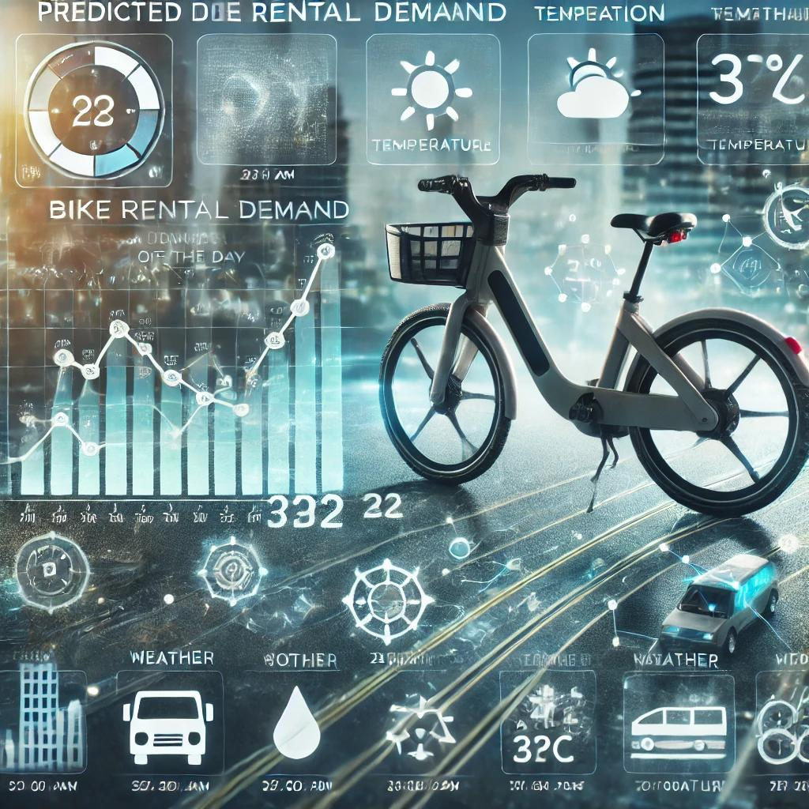

;

-----

# ***Bike Rental Demand Predictions***

# **Introduction**

<h4>

The evolution of modern urban transportation, driven by burgeoning urban populations, has been substantial. This paper’s data set is based on the urban city of Seoul, in South Korea. Seoul, with a population of nearly 9.86 million in 2015, grappled with the challenges of urbanization. In response, the Korean government introduced a rental bike system in 2015. This initiative aimed to alleviate traffic congestion, mitigate air pollution, and reduce high energy costs while fostering a healthier society and elevating citizens’ quality of life.

</h4>

----

# **Problem Statements**

